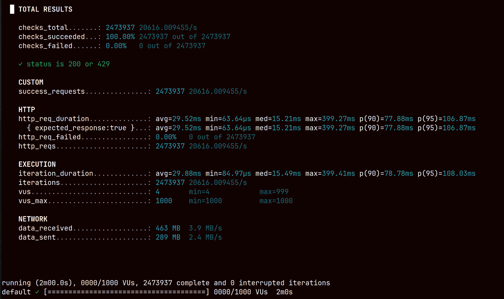

# Distributed Rate Limiter (Token Bucket + Leasing + Redis Lua)

A high-throughput distributed rate limiting system designed to minimize latency and reduce centralized bottlenecks using local token buckets, token leasing, Redis sharding, and Lua-based atomic operations.

---

## Architecture

- **Load Generator**: k6 (EC2, same VPC)
- **Application Layer**: 3 × EC2 `t3.medium` instances
- **Load Balancer**: AWS ALB
- **Datastore**: Redis Cluster (3 shards)
- **Network**: Same VPC (low latency environment)

---

## Key Design Concepts

### 1. Local Token Bucket
- Each instance maintains an in-memory token bucket
- Most requests are served without hitting Redis
- Reduces latency and external dependency

---

### 2. Token Leasing (Batch Allocation)
- Tokens are leased in batches from Redis instead of per request
- Reduces Redis QPS significantly
- Smooths burst traffic

---

### 3. Prefetching Strategy
- Tokens are fetched before depletion
- Avoids blocking requests during refill
- Maintains steady throughput

---

### 4. Redis Sharding
- Redis Cluster with 3 shards
- Partitioned using `tenant_id`
- Distributes write load across nodes
- Avoids single-node bottleneck

---

### 5. Lua Scripts for Atomic Operations
- All token leasing logic is implemented in Redis Lua scripts
- Ensures:
  - Atomic token allocation
  - No race conditions under concurrency
- Avoids multiple round trips for read-modify-write

#### Optimization: Script Preloading
- Lua scripts are loaded **once per node** using `SCRIPT LOAD`
- Cached via SHA1
- Subsequent calls use `EVALSHA`
- Eliminates script transfer overhead per request

---

### 6. Batched Writes via Redis Streams
- Events (analytics/logs) are buffered in memory
- Flushed in batches to Redis Streams
- Reduces write amplification and improves throughput

---

## Request Flow

1. Check local token bucket
2. If tokens available → allow request
3. If below threshold → lease tokens from Redis via Lua script
4. Update local bucket
5. Buffer analytics event
6. Flush events asynchronously in batches

---

## Load Testing

- Tool: k6
- Max VUs: 1000
- Duration: ~2 minutes
- Environment: same VPC

---

## Results

- **Total Requests**: ~2.47M  
- **Throughput**: ~20,600 req/sec  
- **Avg Latency**: ~29 ms  
- **p95 Latency**: ~106 ms  
- **Failures**: 0%  

---

## Additional Optimizations

- Reduced Redis round-trips using leasing
- Lua-based atomic operations (no race conditions)
- Script preloading with `EVALSHA`
- Local caching of token state
- Batched analytics writes
- Shard-aware key distribution

---

## Observations

- Redis is not on the hot path for most requests
- Leasing significantly reduces datastore contention
- Lua scripting ensures correctness under concurrency
- System maintains stable latency at ~20k RPS

---

## Limitations

- Tested only within same VPC (no internet latency)
- No failure simulation (Redis/node failures)
- No global rate limit guarantees across regions
- t3 burstable instances may not reflect sustained load behavior

---

## Future Work

- Multi-region rate limiting (eventual vs strict consistency)
- Failure testing (Redis shard/node failures)
- Adaptive leasing size
- Autoscaling under load
- Internet-latency benchmarking
- CPU/memory profiling under saturation

---

## Goal

This project focuses on:
- Understanding distributed rate limiting tradeoffs
- Reducing centralized bottlenecks
- Designing for high throughput with controlled latency

---

## Summary

Combining:
- local token buckets  
- token leasing  
- Redis Lua scripting  
- Redis sharding  

enables high-throughput rate limiting while maintaining correctness and low latency — with tradeoffs in strict global consistency.

---
